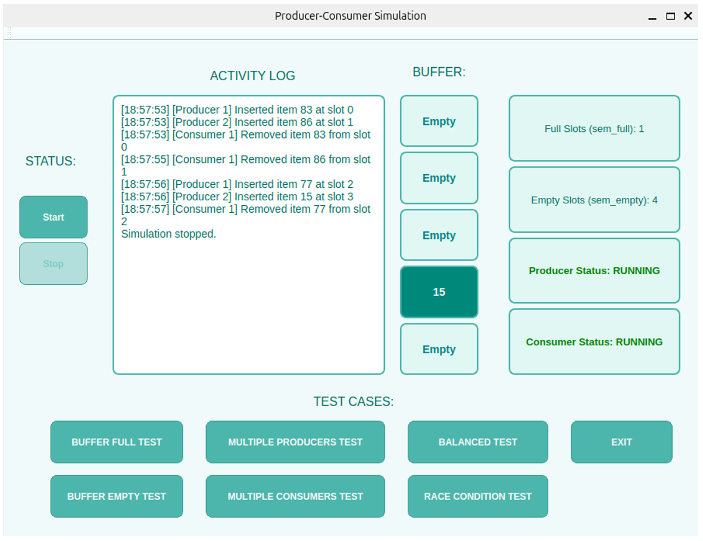

# Producer-Consumer Simulation (Qt + C++)

A GUI-based simulation of the classic **Producer-Consumer** synchronization problem, built with **Qt Widgets** and **POSIX threads (pthreads)** for an Operating Systems course.

The app visualizes a bounded buffer in real time, shows live semaphore and mutex state, and includes dedicated test modes for demonstrating race conditions and edge cases (full buffer, empty buffer, imbalanced producers/consumers).

## Screenshot



## Features

- **Live buffer visualization** — 5 buffer slots update in real time (color-coded full/empty) via a `QTimer` polling every 500ms.
- **Semaphore & thread status display** — shows current `sem_empty` / `sem_full` counts and whether the producer/consumer is `RUNNING` or `BLOCKED`.
- **Persistent event log** — every insert/remove is timestamped and written to `simulation_log.txt`, then mirrored into the GUI log panel.
- **Multiple test scenarios**, each triggered by its own button:

| Button | Scenario | Purpose |
|---|---|---|
| Start | 2 producers, 1 consumer (mutex + semaphores) | Baseline correct, synchronized behavior |
| Test Race Condition | 2 producers, **no mutex/semaphores** | Deliberately demonstrates a race condition on the shared buffer index |
| Test Buffer Full | Buffer pre-filled | Shows the producer blocking on `sem_empty` |
| Test Buffer Empty | Buffer starts empty | Shows the consumer blocking on `sem_full` |
| Test Multiple Producers | 4 producers, 1 consumer | Demonstrates contention among producers |
| Test Multiple Consumers | 1 producer, 4 consumers | Demonstrates contention among consumers |
| Stop | — | Gracefully stops all threads and destroys sync primitives |
| Exit | — | Stops the simulation and closes the app |

## Synchronization Design

- **`sem_empty`** *(counting semaphore, init = BUFFER_SIZE)* — tracks free slots; producers wait on it before inserting.
- **`sem_full`** *(counting semaphore, init = 0)* — tracks filled slots; consumers wait on it before removing.
- **`mutex`** — protects the shared buffer array and the `in`/`out` indices during insert/remove.
- **`log_mutex`** — a separate mutex guarding writes to `simulation_log.txt`, so concurrent threads don't interleave log lines.

The **race condition test** intentionally skips `mutex` and the semaphores in `producer_no_mutex()`, and adds a small `usleep(10)` between reading and writing the shared index to reliably widen the race window — making the resulting data corruption (duplicate/lost writes) visible in the log.

## Project Structure

```
producerconsumer/
├── build/Desktop-Debug/     # Qt build artifacts
├── main.cpp                 # Application entry point
├── mainwindow.cpp            # Core logic: threads, sync primitives, UI updates
├── mainwindow.h              # Class declaration, constants (e.g. BUFFER_SIZE)
├── mainwindow.ui              # Qt Designer UI layout
├── producerconsumer.pro       # Qt project/build configuration
├── producerconsumer.pro.user  # Qt Creator user settings (IDE-specific)
└── simulation_log.txt         # Runtime-generated event log
```

## Requirements

- Qt 5 or Qt 6 (Widgets module)
- A C++ compiler with pthreads support (Linux/macOS natively; on Windows use MinGW or WSL)
- Qt Creator (recommended) or `qmake` + `make` from the command line

## Building & Running

**Using Qt Creator:**
1. Open `producerconsumer.pro`.
2. Configure the project with your Qt kit.
3. Build and run (`Ctrl+R`).

**Using the command line:**
```bash
qmake producerconsumer.pro
make
./producerconsumer
```

## Usage

1. Launch the app and click **Start** to run the balanced (correct) simulation.
2. Watch the buffer slots fill and empty, and observe the semaphore counters and producer/consumer status labels update live.
3. Click **Stop** before switching to a different test scenario.
4. Try **Test Race Condition** and inspect `simulation_log.txt` — you'll see evidence of both producers writing to the same slot, illustrating why synchronization is necessary.
5. Explore the buffer-full, buffer-empty, and multi-producer/consumer tests to see blocking behavior under different load conditions.

## Known Limitations

- Buffer and synchronization primitives are global rather than encapsulated in the `MainWindow` class — simple for a single-window demo but not reusable/testable in isolation.
- Switching test modes without clicking **Stop** first may leave prior threads running briefly, since `running` is checked only at the top of each thread's loop.
- The log file is opened/closed on every single write (not performance-optimal), which was a deliberate tradeoff to keep the log durable and easy to tail/inspect during the demo.

## Note

Built as a course project for Operating Systems, demonstrating the Producer-Consumer problem using pthreads, mutexes, and counting semaphores with a live Qt GUI.

## 👥 Team

- [Aila Naeem](https://github.com/ailaa159)
- [Neamah Khawar](https://github.com/neamah-k)